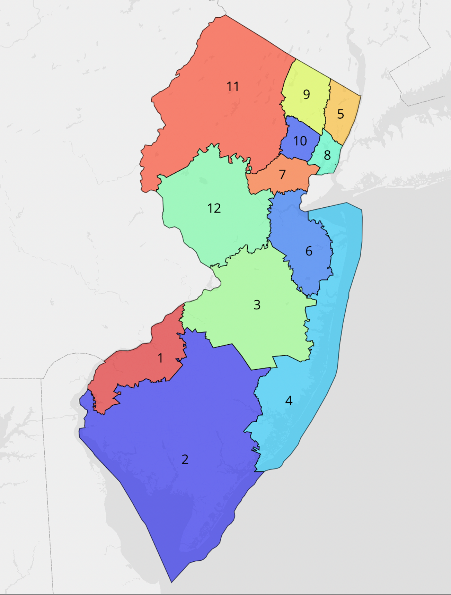
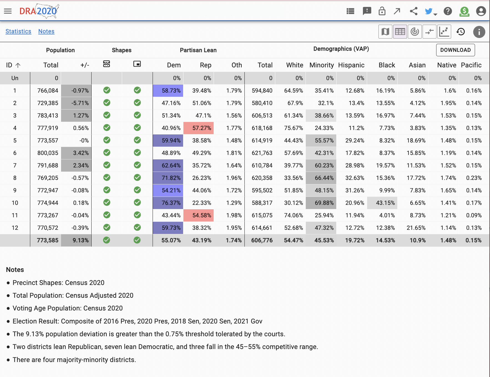

# NJ-Fair-Redistricting

# Fair Map using Flood Fill

This project uses a modified flood-fill algorithm to redistrict New Jersey in a way that minimizes the effects of gerrymandering, focusing on population balance and geographic contiguity. It begins with a partially painted map to maintain group interests and then optimally assigns precincts to districts, ensuring each district grows with balanced populations. This project is structured in two parts: Part 1, using the flood-fill algorithm to assign precincts, and Part 2, filling in unassigned precincts.

## Part 1: Flood Fill Algorithm for Initial District Assignment

The algorithm begins by selecting hand-picked seed precincts for each of the 12 districts to optimize for compactness and proportional representation. The flood-fill algorithm iterates through these precincts, expanding each district based on population balance and geographic constraints.

### Modified Flood Fill Algorithm Summary

- **Queue Initialization**: Each district starts with a queue of precincts to evaluate. The algorithm iterates, processing precincts for the district with the smallest population to balance growth across all districts.
- **Precinct Evaluation**: For each district, the algorithm processes precincts from its queue, assigning them based on contiguous borders and population checks. If a precinct addition fails the contiguity or population balance check, the assignment reverts.
- **Adding Neighbors**: Once a precinct is successfully assigned to a district, the algorithm adds its unassigned neighbors to the district’s queue, expanding outward in a breadth-first manner from the initial precincts.

In summary, the algorithm assigns precincts to districts using a breadth-first expansion that maintains contiguous and balanced district growth.

## Part 2: Fill in Unassigned Precincts

After the initial district assignment, any remaining unassigned precincts are assigned to the least populated neighboring district. The algorithm iterates through unassigned precincts, ensuring that each precinct borders an existing district before assigning it to the district with the smallest population.

### Detailed Steps for Filling Unassigned Precincts

1. **Identifying Unassigned Precincts**: Unassigned precincts are initially marked and grouped.
2. **Assigning to Neighboring Districts**: The algorithm checks neighboring districts of each unassigned precinct and assigns it to the district with the lowest population among neighbors.
3. **Contiguity Check**: After assignments, the algorithm verifies that each district remains contiguous. If any district becomes non-contiguous, the assignment is reverted, and the loop continues until all precincts are assigned without breaking contiguity.

### Exporting Results
Once all precincts have been assigned, the updated district assignments are saved in a CSV file.

---
# Generated Redistried Map using Flood Fill

*Above: Rendered map of New Jersey showing redrawn Congressional districts aimed at reducing gerrymandering using the modified flood filled algorithm. Each district is uniquely colored, numbered, and shaped to maintain compactness and population balance, while considering community interests*

Each district's population deviation, partisan balance, and demographic makeup help illustrate the effectiveness of the algorithm in minimizing gerrymandering effects by creating more equitable and balanced districts. 

*Above: Table overview of population distribution, partisan lean, and demographic breakdown for each district generated by the flood-fill algorithm.* 
This image provides an in-depth look at how the algorithm achieves balanced population across districts while considering partisan competitiveness and minority representation. 

This algorithm offers a robust approach to creating fairer and more balanced districts, minimizing gerrymandering through a principled and data-driven process.
